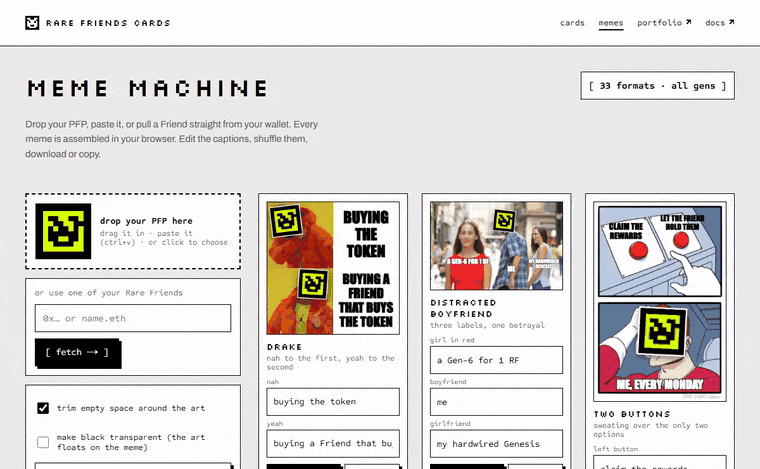

# Rare Friends Cards + Meme Machine

**Live: <https://rare-friends-cards.vercel.app>** | Memes: <https://rare-friends-cards.vercel.app/memes>



Shareable stat cards and memes for Rare Friends holders. Paste a wallet address or ENS name. No wallet connect,
no signature, read-only.

- `/card/<wallet>`: portfolio card (all Friends) plus a list of each Friend
- `/card/<wallet>/<id>`: single Friend card (`gen-<id>` picks the Generations Friend when a wallet holds both #id)
- `/card/<wallet>/og`, `/card/<wallet>/<id>/og`: 1200x630 PNGs, rendered with `next/og` (satori)
- `/memes`: the Meme Machine. Pick one of your Friends and it becomes the face of 30 classic templates, plus three
  drawn in code (Classic, Deal with it, Holo card). Its real on-chain artwork is placed on every face slot.

Works on phones: pages fit 320px and up, every control is a 44px tap target, and tapping a card opens it full size.

rarefriends.com's own portfolio page links here: its **Share** button opens `/card/<your wallet>`.

## Data

rarefriends.com's public `/api/protocol/snapshot` (prices, weights, reward streams) and
`/api/protocol/owned-nfts?address=...` (the wallet's Friends), plus Robinhood Chain reads per Friend (`positions`,
`earned`, the Friend's wallet balances, `tokenURI`) and the holder's `Activated` events for the APR denominator. See
`lib/upstream.ts`. Their per-wallet state endpoint was retired on 2026-09-25; their routes are undocumented and move
without notice. Every render reads fresh and stamps the block it was read at on the card. Pages embed the card
rendered from the same read as the numbers around it, so the two always agree; the `/og` PNG for link previews is
CDN-cached for two minutes. Optional: set `ROBINHOOD_RPC_URL` to put a private RPC ahead of the public ones.

Every derived number is one of rarefriends.com's own formulas: Your APR = the current active stream divided by the RF
you paid to activate, annualized; Pending = (stream remaining + pending) x your share of active weight; a Friend's
pending = the same with the Friend's own share. Their formulas change without notice (the APR numerator lost pending
fees on 2026-09-20), so re-check them against <https://github.com/spokesz/rarefriends-web-public> before trusting a
difference.

## Run it

```sh
npm ci
npm run dev          # http://localhost:3000
npm run build && npm start
```

Stack: Next.js 15, React 19, `next/og` for the PNGs. FriendSDK is not used. Set `NEXT_PUBLIC_SITE_URL` if the
production domain changes.

## Credits

- **Fonts:** Silkscreen (Jason Kottke) and Sometype Mono (Dharma Type), SIL Open Font License 1.1, bundled in
  `assets/fonts` (see `assets/fonts/LICENSE.txt`). Page text is Archivo (Omnibus-Type, SIL OFL 1.1), loaded with
  `next/font`.
- **Friend artwork** is each NFT's own on-chain SVG, read from rarefriends.com and rendered unmodified.
- **Meme templates** in `public/memes/` are widely circulated internet meme images, sourced via imgflip.com. They are
  not ours; all rights belong to their original creators. They are used only as backgrounds for holders' own memes:
  Drake, Distracted boyfriend, Two buttons, Change my mind, Expanding brain, Gru's plan, Once again asking (Bernie),
  Is this a pigeon?, Panik/kalm/panik, Buff doge vs cheems, Trade offer, Always has been, This is fine, Surprised
  Pikachu, Woman yelling at cat, Hide the pain Harold, Draw 25, Tuxedo Pooh, Monkey puppet, Left exit 12, Batman
  slapping Robin, Mocking SpongeBob, Ancient Aliens, Roll Safe, Spider-Man pointing, Sad Pablo, DiCaprio cheers,
  Anakin and Padme, They don't know, Boardroom suggestion.

## Licence

MIT for the code in this repository. The meme template images and the fonts keep their own terms, above.
